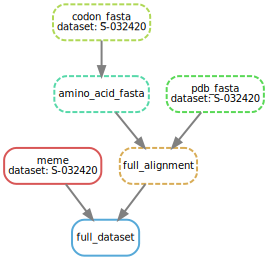

# coronavirus-visualization

## Installation

### Library

```
npm install coronavirus-visualization
```

### Development

```
git clone https://github.com/stephenshank/coronavirus-visualization
cd coronavirus-visualization
yarn
conda env create -f environment.yml
```

## Usage

### NPM Library

In an environment with SASS support:

```
import { render_meme } from "coronavirus-visualization";
import "coronavirus-visualization/styles.scss";

render_meme(
	"/path/to/meme/json",
	"/path/to/full/fasta",
	"/path/to/base/fasta",
	"/path/to/pdb/file",
	"dom_element_id"
)
```

See `library-consumer` for a minimal working example.

### Pipeline

Place a concatenated codon alignment and tree at `public/input/$DATASET.fna` and a PDB file at `public/input/$DATASET.pdb` (and make a pull request!).

Run:
```
snakemake public/output/$DATASET.txt
```

This is a dummy endpoint that will ensure all necessary file are created, running the following pipeline:



#### codon_fasta
Removes tree from FNA file, resulting in codon aware MSA.

#### amino\_acid\_fasta
Translate codon aware MSA.

#### pdb_fasta
Extracts 'A' chain from PDB file and writes to a FASTA file.
See `public/input/S-structure.fasta` for this file.

#### full_alignment

Adds pdb_fasta to the translated MSA, via

```
mafft --add {input.pdb} {input.msa} > {output}
```

#### meme

HyPhy's MEME method.

#### full_dataset

Dummy file to ensure all necessary files are appropriately placed.

### Development

Run

```
yarn develop
```

and visit `localhost:$PORT/$DATASET`.

## Deployment

Set environment variable `$PORT` and run

```
npx webpack
node server.js
```